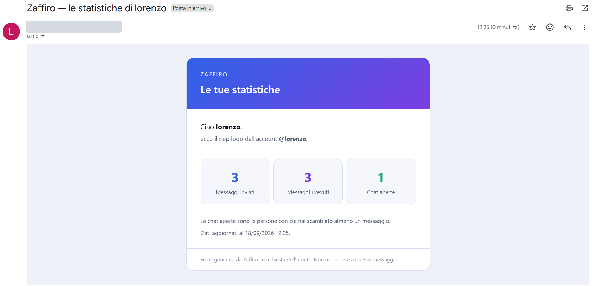

# Zaffiro — Mini WhatsApp

A minimal one-to-one chat: every registered user sees who they can talk to and opens a
private conversation. A message reaches **only** its recipient, through the broker user
destinations, and never the other subscribers.

- `BE/` — Spring Boot 4.1.1, Java 25, PostgreSQL, STOMP over WebSocket. See [BE/README.md](BE/README.md).
- `FE/` — React 19, TypeScript, Vite. See [FE/README.md](FE/README.md).

## The four rules of the assignment

| Rule | Where it lives |
| --- | --- |
| The message reaches only the recipient, through the broker user destinations | `ChatSocketController` publishes with `convertAndSendToUser` on `/user/queue/messages`. No broadcast destination exists. |
| The sender comes from the session `Principal`, not from the client payload | `SendMessageRequest` has no sender field; `ChatService.send` takes `principal.getName()`. |
| A message is stored first, with the id and the instant assigned by the server, and delivered only after | `ChatService.send` is `@Transactional` and publishes nothing; the controller delivers after it returns. |
| The client merges the REST history with the open channel, without duplicates and in server order; an offline recipient finds the message later | `mergeMessages` in `FE/src/lib/conversations.ts` keys by server id and sorts by `sentAt, id`. Messages for an offline user stay in the database. |

## Beyond the assignment

- `GET /api/conversations` builds the contact list in one request — people, latest
  message and unread counts — with two queries regardless of how many contacts there are.
- Unread counts are derived from `message.read_at`, so they survive a reload instead of
  living in the browser.
- Three delivery states per message — `SENT`, `DELIVERED`, `READ` — stored in columns and
  pushed to the author on `/user/queue/receipts` as they change, so the ticks move on
  their own.
- **AI reply suggestion**: the ✦ button in the composer asks an LLM on OpenRouter
  (`nvidia/nemotron-3.5-lightning:free` by default, with reasoning enabled) for the next message, using the last 20
  messages as context, and writes in the language the user writes in (Italian for a new conversation). Each user picks the token limit of
  their suggestions in the settings panel (gear button). The text only fills the composer: it is never stored, and the user
  decides whether to edit and send it.
- **Account stats by email**: the chart button in the sidebar shows messages sent,
  messages received and open chats (people with at least one message). "Invia per email"
  sends them with a Thymeleaf HTML template to the address in `MAIL_USERNAME`, the same
  for every user.

  
- Presence on `/topic/presence`, the one broadcast in the application, carrying no
  message content.

## Quick start on Windows

1. PostgreSQL running, with the `U5W6D5-PROGETTO-SETTIMANALE` database. It already exists
   for this project; otherwise create it (the quotes keep the exact case and the hyphens):

   ```sql
   CREATE DATABASE "U5W6D5-PROGETTO-SETTIMANALE";
   ```

2. Copy `.env.example` to `.env` and fill it in. That file is git-ignored, so no secret
   reaches the repository.
   - `DB_PASSWORD`: your PostgreSQL password. Without it the script asks for it each time.
   - `OPENROUTER_API_KEY` (and optionally `OPENROUTER_MODEL`): enables the AI suggestion.
   - `MAIL_USERNAME` and `MAIL_PASSWORD`: a Gmail address and a Google
     [App Password](https://myaccount.google.com/apppasswords) for it. They enable the stats email.

   The app starts without the optional keys; the matching feature answers with a clear error.

3. Double click **`start.cmd`**, or run it from a terminal.

   It checks that Java and npm are there, installs the frontend dependencies the first
   time, opens the backend and the frontend in one window each, waits for both to answer
   and then opens the browser.

4. Create two accounts in two different browser profiles (or one normal window and one
   private window) and write to each other.

Close the two windows to stop the servers.

## Manual start

1. Backend — the password comes from the environment, never from the repository:

   ```bash
   cd BE
   DB_PASSWORD='<your password>' ./mvnw spring-boot:run
   ```

   ```powershell
   # PowerShell
   cd BE
   $env:DB_PASSWORD = "<your password>"
   ./mvnw spring-boot:run
   ```

2. Frontend:

   ```bash
   cd FE
   npm install
   npm run dev
   ```

3. Open <http://localhost:5173>.

## Log agent

`.claude/agents/log-agent.md` is a Claude Code subagent that works on `BE/logs/`
(see [Logging](BE/README.md#logging)). Ask Claude Code, for example:

- `use log-agent: error report for today`
- `use log-agent: chat usage statistics`
- `use log-agent: what happened to user mario in the last hour`
- `use log-agent: log maintenance`

It writes reports to `BE/logs/reports/` and one line per run to `BE/logs/agent.log`.
It never edits source code and asks before deleting any file.

### Sample report: chat usage statistics

Output of `use log-agent: chat usage statistics` on 2026-09-18 (10:49–12:26, one
development session). `BE/logs/` is git-ignored, so a copy of the report is kept in
[docs/reports/2026-09-18-statistiche-uso.md](docs/reports/2026-09-18-statistiche-uso.md).
The `zztest*` accounts are automated test users and are excluded from the figures.

| Metric | Value |
| --- | --- |
| Active users | 2 (`lorenzo`, `bruno`) |
| Logins / failed logins | 5 / 0 |
| Messages sent | 6 (3 each way) |
| Delivered / read | 6/6 (100%) / 6/6 (100%) |
| Send → delivery (median) | ~7 ms |
| Send → read (median) | ~25 ms (one outlier read after 2.2 s) |
| AI suggestions | 3 (+5 from test accounts) |
| Stats emails | 1 |

| User | Logins | WS connects | Sent | Received | AI suggestions | Stats emails |
| --- | --- | --- | --- | --- | --- | --- |
| lorenzo | 4 | 4 | 3 | 3 | 2 | 1 |
| bruno | 1 | 2 | 3 | 3 | 1 | 0 |

All the real messages fall between 12:09 and 12:12. The sample is too short to show
peak hours or recurring patterns.

## Note

CSRF protection is disabled in this build, which is acceptable for a local exercise only.
The reason and the fix are documented in [BE/README.md](BE/README.md#security-notes).
